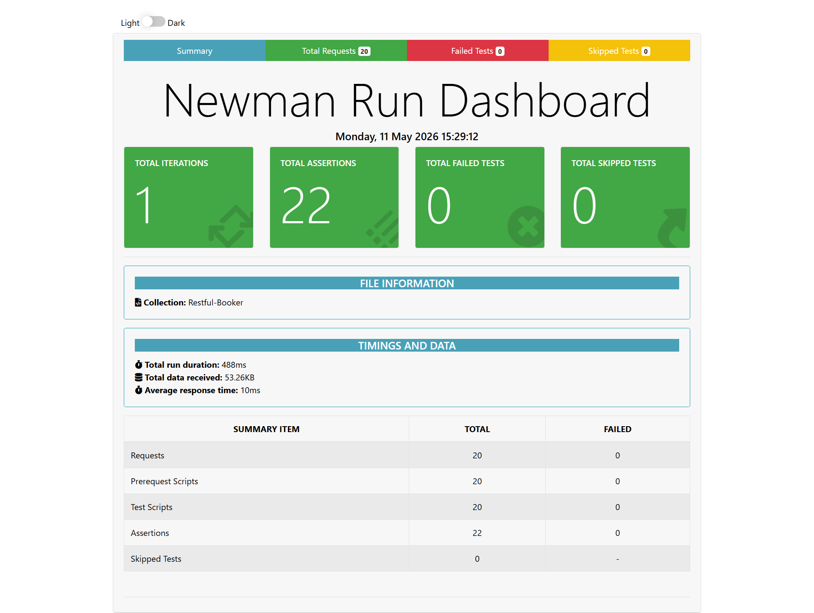
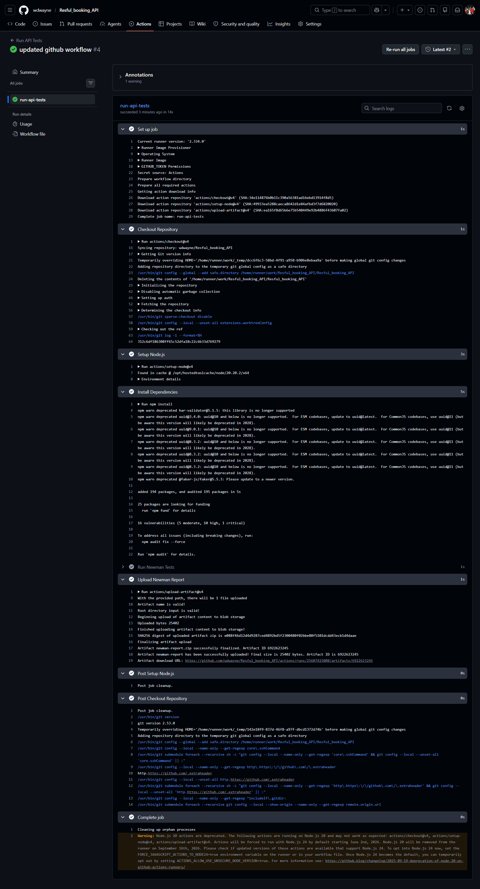

# Restful Booker API Test Project

## 📌 Project Overview
This project focuses on automated API testing of the Restful Booker application using Postman and Newman.

The goal of the project is to validate core booking functionality, authentication, CRUD operations, and negative scenarios while demonstrating API automation and test organization practices.

## Aplication Under Test
- Application: Restful Booker
- Type: Web Based API

## Test Scope
*In scope*
- Authentication
- CRUD functionalities
- performance testing

*Out of Scope*
- Third party integration
- Backend/Database verification

## ✅ Features Tested

- Authentication
- Create Booking
- Retrieve Booking
- Update Booking
- Partial Update Booking
- Delete Booking
- Invalid ID Handling
- Response Validation
- Response Time Validation

## 🧪 Testing Types Performed

- API Testing
- Automation Testing
- Exploratory Testing
- Negative Testing

## 📂 Test Artifacts

This project includes the following QA deliverables:

- 📄 Test Plan 
- ✅ Test Cases  
- 🐞 Bug Reports  
- 📊 Test Execution Report 

## 🐞 Key Findings

## 🛠️ Tools Used
- Version control: Git & GitHub
- Documentation: Markdown
- Tools: Postman, Newman

## 📁 Project Structure
restful-booker-api-testing/
│
├── postman/
│   ├── collections/
│   └── environments/
│
├── docs/
│   ├── test-plan.md
│   ├── api-test-strategy.md
│   └── api-test-cases.md
│
├── reports/
│
├── ci-cd/
│
└── README.md

## ▶ Running the Tests

### Run with Newman

---bash
newman run postman/collections/restful-booker.postman_collection.json

## 🚀 How to Navigate

- Start with the **Test Plan** to understand the testing approach  

---

## 👤 Author

Dwayne Williams  
Software Quality Assurance Analyst 

## 📊 Newman HTML Report

## 🔄 GitHub Actions CI Pipeline
